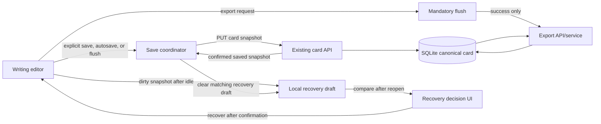

# WRITER-READY-01: Writer Journey Contract

**Status:** approved functional contract; specification only
**Repository:** `tpoh93/Writers-Room-app`
**Base revision:** `770e14c52ce691c8480069173d260ca0bd1e6242`
**Scope:** the complete writer path: project → scene → writing → save → close or reopen → recovery → export.

## 1. Goal

WRITER-READY-01 defines the reliability contract for a writer working in
NovelForge. It makes saved text durable in SQLite, protects an unsaved local
draft from a crash or failed save, and prevents an export from silently using
older data.

This document is a product and acceptance contract. It does not authorize or
describe an implementation plan, production-code change, schema migration, or
Visual Language work.

## 2. Scope and boundaries

WRITER-READY-01 covers:

- creating and opening a project;
- creating, selecting, and editing a writing card that acts as a scene or
  chapter;
- explicit save, backend autosave, local emergency draft, and save-state UI;
- flushes before navigation, export, and controlled close;
- reopen and user-controlled recovery;
- local version history;
- deterministic project-card export;
- restart, Compose persistence, and SQLite backup/restore evidence.

The canonical source of truth for saved writing remains SQLite. A local
recovery draft is a safety copy, never an alternative canonical document.

## 3. Definitions

### Project

A persisted `Project` record that owns a set of cards. It is created and read
through the existing project API and is the persistence boundary for a writer's
work.

### Card

A persisted `Card` record belonging to one project. Its JSON `content`, title,
tree parent, and display order are stored in SQLite.

### Writing card

A card whose configured existing card type is designated below for prose
writing. The designation is a presentation and behavior contract over existing
cards; it does not introduce a new database table or a `Scene` entity.

| Existing type | Existing model/editor | WRITER-READY-01 role |
|---|---|---|
| `章节正文` | `Chapter` / `CodeMirrorEditor` | Primary writing card. It may represent either a chapter or a scene, according to its existing project-tree placement and title. |
| `通用文本` | text / `MarkdownTextEditor` | Secondary writing card. It may represent a scene, interlude, or prose fragment and receives the same save/recovery contract for its text field. |
| `场景卡` | `SceneCard` / generic card editor | Reference and world-state card only. It is not a WRITER-READY-01 prose-writing scene unless a future approved contract changes its editor role. |

### Scene

A scene is either a `章节正文` or `通用文本` writing card used as one unit of
prose composition. A chapter is a `章节正文` writing card. Both remain cards
and may be nested in the existing card tree. A separate domain model for
scenes is outside this scope.

### Dirty draft

The current in-memory editor content differs from the latest content confirmed
as saved by the backend for the active writing card. Dirty includes title,
prose content, and every writer-visible field that a save operation persists.

### Canonical save

A successful write of the active card to the existing backend API followed by
successful SQLite persistence. The frontend may display `saved` only after the
API reports success. The server response is the authoritative saved snapshot.

### Local recovery draft

A local browser-storage record containing a dirty writing-card snapshot and
recovery metadata. It is keyed by project ID and card ID, and is written only
to protect work that has not yet become canonical. It cannot overwrite SQLite
automatically.

### Mandatory flush

An attempt to persist pending dirty changes before an operation that could
change context, end a controlled session, or produce an external artifact. A
flush succeeds only after canonical save success; a failed flush blocks the
dependent operation.

## 4. Current system baseline

The current product already persists projects and cards in SQLite, uses cards
as the editor tree, and saves a card through `PUT /api/cards/{card_id}`. The
current `CodeMirrorEditor` binds `Cmd/Ctrl+S` to its save handler. The generic
card editor exposes a visible save action and writes local version snapshots
after a successful save. Exports are generated on the backend from persisted
project cards in `txt`, `md`, and `json` formats.

The current product has no writer-draft autosave contract. Its existing
`localStorage` version history is not a crash-recovery draft, and the existing
backup/restore service protects the SQLite database rather than unsaved editor
memory. Existing workflow recovery is likewise distinct from writer-text
recovery.

The implementation must preserve the current project/card API and SQLite
authority unless a separately approved contract changes them.

## 5. Target architecture

### 5.1 Ownership

| Layer | Responsibility | Must not do |
|---|---|---|
| Writing editor | Own in-memory text, dirty state, explicit save command, and local-draft scheduling. | Claim a save without backend acknowledgement. |
| Save coordinator | Serialize saves for the active card, schedule autosave, expose retry, and perform mandatory flush. | Send duplicate writes for unchanged content. |
| Local recovery-draft store | Persist and compare emergency snapshots by project/card identity. | Become canonical or silently replace SQLite data. |
| Existing card API | Validate and persist canonical card content. | Treat local browser data as authoritative. |
| SQLite | Store canonical project/card records. | Store browser-only recovery drafts unless separately approved. |
| Export service | Read canonical cards after a successful flush and produce a deterministic artifact. | Export an older server snapshot after a failed flush. |

### 5.2 Storage records

The recovery-draft record must contain at least:

```text
storage key: nf:v1:writer-recovery:{projectId}:{cardId}
projectId: number
cardId: number
savedCardFingerprint: string
draftFingerprint: string
capturedAt: ISO-8601 timestamp
title: string
content: JSON-compatible writer content
reason: local-idle | failed-save | network-error | controlled-close
```

The exact serialization may evolve, but the key must include both project and
card identity. No recovery record may be applied to a different project or
card. Stored content must be sufficient to reconstruct the writing-card fields
that a normal save would write.

### 5.3 Data flow



The backend save returns the canonical snapshot. The coordinator updates the
editor baseline only from that confirmed result. A matching recovery draft is
removed only after that result has been accepted by the editor.

## 6. Save state machine

The UI must show one primary state for the active writing card:

| State | Entry condition | Required UI and behavior |
|---|---|---|
| `saved` | Current editor snapshot equals the last confirmed canonical snapshot. | Show saved state and no pending-save claim. |
| `dirty` | A writer-visible persisted field differs from the canonical baseline. | Show unsaved changes; schedule local draft and eligible backend autosave. |
| `saving` | One save request for the current or newer snapshot is in flight. | Show saving; prevent a second equivalent request. New edits remain dirty for a later save. |
| `save-error` | A save request fails or is rejected. | Show a persistent error, retain dirty content and recovery draft, and expose retry. |

Transitions:

1. `saved → dirty` after a persisted writer-visible edit.
2. `dirty → saving` for `Cmd/Ctrl+S`, an eligible autosave, retry, or mandatory
   flush.
3. `saving → saved` only when the response confirms the same latest snapshot.
4. `saving → dirty` when a newer edit occurred while an older snapshot saved;
   the coordinator schedules the newer snapshot.
5. `saving → save-error` on a network error, timeout, non-success response, or
   persistence failure.
6. `save-error → saving` only through retry, explicit save, eligible autosave,
   or a mandatory flush.
7. `save-error → dirty` when the user edits again; the error remains visible
   until a later canonical save succeeds or the active card changes only after
   a successful mandatory flush.

No transition may discard the in-memory draft. A local recovery draft is kept
for every `dirty`, `saving`, or `save-error` snapshot until canonical save
confirmation proves it redundant or the user explicitly discards it.

## 7. Scheduling contract

### 7.1 Local recovery draft

After any dirty writing edit, the application writes the current recovery
draft after an idle debounce between two and five seconds. The chosen value
must be a single documented value within that range and must be exercised by
tests using controllable timers.

The local-draft write is debounced: continued typing resets its timer. It must
not issue a backend request. A local-storage write failure must not erase the
in-memory draft or claim recovery protection; the UI may surface a non-blocking
warning, while canonical save remains available.

### 7.2 Backend autosave

Backend autosave is eligible only when all conditions hold:

- the active writing card is dirty;
- no equivalent snapshot is already being saved;
- the most recent canonical-save attempt for that card is at least 30 seconds
  old, or no canonical save has yet occurred in the current edit session;
- the editor has a complete serializable snapshot.

The implementation may use a longer interval than 30 seconds, but it must not
perform automatic backend saves more frequently than once per 30 seconds for a
given writing card. It must not send an autosave if the snapshot fingerprint is
unchanged from the last confirmed save or the snapshot already queued.

An explicit `Cmd/Ctrl+S`, retry, or mandatory flush is immediate and is not
delayed by the autosave interval. It still uses the same save coordinator so
that concurrent writes are serialized.

## 8. Mandatory flush

The application must attempt a mandatory flush before:

- `Cmd/Ctrl+S` completion;
- changing the active scene/card;
- changing the active project;
- starting export;
- controlled close of the editor view or application.

If the card is already `saved`, flush completes without a redundant request.
If it is dirty, saving, or in `save-error`, flush targets the newest editor
snapshot and waits for an explicit result.

On success, the dependent operation may continue. On failure, the dependent
operation is blocked, the current editor remains open, and the UI explains
that the content was not saved. The UI provides Retry and Cancel. Cancel keeps
the current context and leaves the emergency draft intact.

Browser process termination cannot guarantee an asynchronous request. For an
uncontrolled force-close, the local recovery draft is the required protection;
the application must never claim that a final backend flush completed.

## 9. Failure behavior

### Network failure

On timeout, offline status, connection failure, or aborted request:

- transition to `save-error`;
- retain the full editor draft;
- retain or immediately write the matching recovery draft;
- show a clear, actionable error with Retry;
- block mandatory-flush-dependent navigation and export;
- never mark the document as saved.

### Backend failure

On a non-success backend response, validation error, or persistence error:

- retain the full editor draft and recovery draft;
- expose the backend-safe error message without presenting a false success;
- allow retry after the user fixes any actionable validation issue;
- block dependent operations until canonical save succeeds or the user remains
  in the current editor.

### Local-storage failure

Failure to write the recovery draft does not change canonical-save status. The
editor remains usable, but the UI must not claim local crash protection. A
later successful canonical save restores the `saved` state.

## 10. Reopen and recovery

### 10.1 Reopen

WRITER-READY-01 does not restore the last open project or scene automatically.
After a user manually chooses a project and a writing card, the application
loads the canonical card from the backend and then checks the matching local
recovery-draft key.

If no matching recovery draft exists, the editor shows the canonical content.
If a matching draft has the same fingerprint as canonical content, it is stale
and may be removed without a recovery prompt.

### 10.2 Recovery comparison

If the local draft is newer than or different from the canonical snapshot, the
application presents a recovery decision before replacing visible editor data:

- **Recover draft** loads the local draft into the editor as `dirty`; it does
  not write SQLite automatically. The prior canonical content remains
  available in the recovery comparison and in the persisted card until the
  user performs or approves a normal save.
- **Discard draft** removes only that project/card recovery record and opens
  canonical backend content unchanged.
- **Cancel** keeps the decision surface open or returns to a non-destructive
  selection state; it performs neither recovery nor discard.

The recovery UI must identify the project, card, draft timestamp, and whether
the local draft differs from canonical content. It must require an explicit
confirmation before a recovered draft replaces the editor's displayed
canonical content.

### 10.3 Failed-save recovery

A local draft recorded after network or backend save failure is handled by the
same comparison and decision flow. SQLite backup/restore is not a substitute
for this recovery path and must not be cited as proof of unsaved-text recovery.

## 11. Version history

Existing local card-version history remains a user-invoked recovery aid. A
successful canonical save may add a version snapshot under the existing
project/card version key. Version history does not change the canonical source
of truth and does not replace the emergency recovery-draft record.

Restoring a historical version must present confirmation, place the selected
content into the editor, mark it dirty, and use the normal canonical save path.
It must not silently overwrite current SQLite data. Version-history limits and
retention remain the existing product behavior unless separately changed.

## 12. Export contract

The supported formats are `txt`, `md`, and `json`. The supported scopes are all
cards, one selected card, and cards of one selected type.

Before export, the application performs mandatory flush for the active writing
card if it has unsaved changes. Export begins only after success. The export
service then reads canonical backend data and produces the existing
deterministically ordered card sequence.

If flush fails, export is blocked with an explicit save-error message. The
application must not silently download an artifact generated from an older
canonical snapshot. If no active writing card is dirty, the export request may
proceed without an unnecessary save.

Each export acceptance check must verify artifact content, selected scope,
format, and deterministic ordering, not merely that a browser download began.

## 13. Restart, Compose, and SQLite backup/restore

`docker compose down` followed by `docker compose up -d` preserves the named
SQLite and backup volumes in the canonical local deployment. After restart,
manually selecting the same project/card must load the last canonical SQLite
content or follow the recovery decision contract when a newer local draft
exists.

SQLite backup/restore remains an operational mechanism:

1. create an integrity-checked backup;
2. mutate canonical data through the application;
3. restore with the guarded restore procedure and its safety backup;
4. reopen the application and verify the restored canonical state.

This sequence verifies database durability and restoration. It does not prove
or replace local unsaved-draft recovery.

## 14. Data safety and privacy requirements

- SQLite is canonical for saved text.
- Recovery drafts are local to the browser profile and keyed by project/card.
- No recovery draft may cross project/card boundaries.
- The application must never silently overwrite canonical text with a local
  draft.
- Failed saves must retain editor content and recovery data.
- Logs, committed fixtures, screenshots, PR text, and acceptance evidence must
  use synthetic prose only; they must not contain private writing, credentials,
  provider payloads, or database files.
- Provider API keys must never be stored in recovery drafts or frontend local
  storage.
- Backup files contain private writing and remain sensitive operational data.
- Controlled close attempts flush; force-close relies on local draft and makes
  no false persistence claim.

## 15. Acceptance matrix

Every row is mandatory. The final result is READY only when every row is PASS;
one FAIL or NOT VERIFIED means NOT READY.

| ID | Scenario | Required observable result | Evidence |
|---|---|---|---|
| WR-01 | Project → scene → writing | A synthetic project opens, an allowed writing-card type is selected or created, and prose becomes dirty after edit. | Browser QA recording and API/SQLite check. |
| WR-02 | Local draft idle timing | A dirty draft is stored after the selected 2–5 second debounce and does not write before the timer. Continued typing resets the timer. | Controlled-timer unit test and browser check. |
| WR-03 | Backend autosave | Dirty text is canonical-saved automatically, never more often than once per 30 seconds, and no unchanged snapshot produces an API write. | Fake-clock unit test plus API-call integration test. |
| WR-04 | `Cmd/Ctrl+S` | Shortcut immediately flushes newest text, shows `saving` then `saved`, and persists the server-confirmed snapshot. | Editor component test and browser QA. |
| WR-05 | Scene change | Dirty current scene flushes before selection changes. Failed flush blocks scene change and keeps the draft visible. | Integration test and browser QA. |
| WR-06 | Project change | Dirty scene flushes before project change. Failed flush blocks project change and keeps current project/card context. | Integration test and browser QA. |
| WR-07 | Controlled close | Dirty content attempts flush; success permits close and failure blocks close with Retry/Cancel. | Component/integration test and browser QA. |
| WR-08 | Force-close | After crash simulation, no false saved claim exists; reopening exposes a recoverable local draft when it differs from canonical. | Browser/process recovery drill. |
| WR-09 | Network failure | Save transitions to `save-error`, retains draft, records recovery data, offers retry, and blocks flush-dependent operations. | Mocked integration test and browser QA. |
| WR-10 | Backend failure | Non-success persistence response retains draft, exposes retry, and never changes UI to saved. | Backend/API integration test and browser QA. |
| WR-11 | Reopen | After manual project/card selection, the exact canonical text appears when no newer draft exists. | Restart/browser QA and direct SQLite/API comparison. |
| WR-12 | Recover draft | A newer/different local draft needs explicit confirmation, opens dirty, and does not overwrite SQLite before normal save. | Component/integration test and browser QA. |
| WR-13 | Discard draft | Discard removes only the keyed local draft and displays canonical text unchanged. | Unit test and browser QA. |
| WR-14 | Version history | Restore requires confirmation, returns content to dirty editor state, and uses normal save rather than a silent canonical overwrite. | Component test and browser QA. |
| WR-15 | TXT export | Mandatory flush precedes all-card, single-card, and type-scoped TXT export; content and order are correct. | API/service test and browser artifact inspection. |
| WR-16 | Markdown export | Mandatory flush precedes all-card, single-card, and type-scoped Markdown export; content and order are correct. | API/service test and browser artifact inspection. |
| WR-17 | JSON export | Mandatory flush precedes all-card, single-card, and type-scoped JSON export; content and order are correct. | API/service test and browser artifact inspection. |
| WR-18 | Export with unsaved text | Failed flush blocks every export format and scope; no stale file is downloaded. | Integration test and browser QA. |
| WR-19 | Compose restart | Stopping and starting Compose without volume deletion preserves canonical writing and supports the same reopen/recovery contract. | Controlled Compose evidence and browser QA. |
| WR-20 | Backup → mutate → restore | Guarded SQLite restore returns the backed-up canonical state and leaves the safety-backup evidence; this row is separate from unsaved-draft recovery. | Existing backup test plus controlled operational drill. |
| WR-21 | Evidence closure | All WR rows are PASS; no final evidence row is FAIL or NOT VERIFIED. | Committed redaction-safe acceptance record. |

## 16. Test strategy

### Unit tests

- state-machine transitions and visible labels;
- snapshot fingerprints and equality rules;
- local-draft key isolation by project/card;
- 2–5 second local-draft debounce with fake timers;
- 30-second backend-autosave ceiling and unchanged-snapshot suppression;
- save coordinator serialization and retry;
- recovery comparison and Recover/Discard/Cancel behavior;
- mandatory-flush result handling;
- deterministic export ordering and format serialization.

### Integration tests

- editor/coordinator to existing card API save path;
- SQLite persistence verified through a fresh session;
- network timeout and backend error responses;
- card/project navigation blocked after failed mandatory flush;
- export blocked on failed flush and generated only after confirmed save;
- all export scopes in `txt`, `md`, and `json`;
- restart with a fresh frontend state and persisted local recovery data;
- existing guarded backup/restore path.

### Browser QA

Browser QA uses the canonical web/Compose path and synthetic data only. It
must execute every acceptance row that names browser QA, capturing redacted
screenshots or recordings of save states, recovery decision, blocked export,
and generated artifacts. It does not inspect credentials, private prose,
cookies, provider payloads, or real user databases.

## 17. Synthetic fixtures

Fixtures must be disposable and contain only invented Polish prose. The
baseline fixture contains:

- project `WRITER-READY Fixture`;
- a permitted chapter writing card `Rozdział 1` with a short synthetic text;
- a permitted scene writing card `Scena 1` nested under the chapter;
- a second scene with deterministic `display_order` for navigation/export;
- a non-writing reference card to verify scope filtering;
- known canonical and local-draft variants, each with visibly distinct but
  synthetic text;
- no API keys, model responses, real names, private notes, database files, or
  backups committed to Git.

The fixture setup must be reproducible from repository instructions and must
use a fresh SQLite path outside committed data. Browser artifacts record the
fixture name, viewport, runtime path, and source revision.

## 18. Evidence requirements

The acceptance record must include:

- source commit and branch;
- exact fixture identifier and confirmation of synthetic content;
- commands, test names, and exit codes;
- browser runtime URL, viewport, and the observed UI states;
- direct API or SQLite evidence for canonical content where a row requires it;
- export filenames, scope, format, and content/order checks;
- local-draft timing and autosave timing evidence using controlled clocks where
  relevant;
- recovery decision outcome and proof that canonical data was not silently
  replaced;
- Compose persistence and backup/restore evidence;
- explicitly recorded exclusions and any test environment limitations.

Evidence must distinguish observed fact from inference. It must not include
private prose, credentials, raw provider payloads, stack traces containing
content, local SQLite files, or backup contents.

## 19. DONE criterion

WRITER-READY-01 is DONE only when:

1. an implementation conforms to every requirement in this contract;
2. the complete writer journey has been run on a fresh synthetic environment;
3. canonical SQLite persistence, local draft recovery, mandatory flush, reopen,
   version restore, and all export formats/scopes have direct evidence;
4. controlled-close, force-close, network failure, backend failure, Compose
   restart, and backup/restore have the specified outcomes;
5. no operation claims success after a failed save;
6. the final acceptance matrix contains zero FAIL and zero NOT VERIFIED rows;
7. all evidence is redaction-safe and reproducible.

## 20. Out of scope

The following are explicitly excluded:

- a new `Scene` table, entity, or domain migration;
- VL-02, VL-03, and any Visual Language redesign;
- new AI capabilities or provider/workflow behavior changes;
- Code Wiki;
- a general card-system refactor;
- automatic restoration of the last open project or scene;
- unrelated backend, frontend, test, CI, dependency, or workflow changes;
- an implementation plan or production-code implementation.
